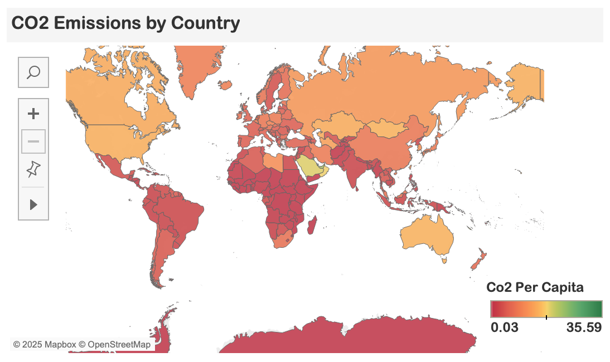
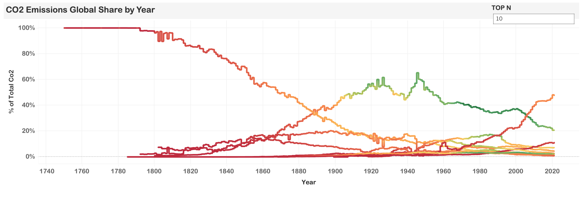

# 🌍 Visualizing Global CO₂ Emissions with Tableau

This project provides an interactive Tableau visualization of global CO₂ emissions, exploring trends across different countries and populations.  

## 📊 Visualizations Included:

1. **CO₂ Emissions by Country** – Total CO₂ emissions for each country.
2. **CO₂ Emissions (2021) vs. Population** – A comparative analysis of emissions against population size.
3. **CO₂ Global Share Over Time** – How each country's share of global emissions has changed over the years.

## 📂 Files in This Folder
- `Global CO2 Emission.twbx` → Tableau Packaged Workbook (interactive visualization)
- `visualizing_global_co2_data.csv` → Dataset used for this visualization
- `visualizing_global_CO2_emissions_data_dictionary.xlsx` → Dataset dictionary
- `images/` → Folder containing exported snapshots of the visualization

## 🔍 Data Source
The dataset was sourced from Maven Analytics **[Global CO2 Emissions](https://maven-datasets.s3.amazonaws.com/Global+CO2+Emissions/CO2+Emissions.zip)**, which provides historical and recent CO₂ emission records by country. 

## 📸 Visualization Preview

### CO₂ Emissions by Country

This file is likely for map visuals (choropleth). It includes 2021 emissions for each country:

🌐 Geographic Patterns
   - High in North America, Europe, and Asia
   - Lower in Africa and parts of Oceania
   - Some entries (e.g., small island nations or territories) have no data — possibly due to negligible emissions or lack of reporting.
     
⚠️ Noteworthy Trends
   - Oil-rich countries like Saudi Arabia and UAE show high emissions relative to their size.
   - Emerging economies (e.g., India, Indonesia, Brazil) are showing increasing contributions to global totals.

     

### CO₂ Emissions (2021) vs Population by Country

This dataset gives a powerful snapshot of how CO₂ emissions vary in scale and intensity across the world. Here are some key insights:

🔹 Top CO₂ Emitters (Total Emissions in 2021)
Country	CO₂ Emissions (Mt)
China	           🥇 Highest emitter globally
United States	   🥈 Second-largest
India	           🥉 Rapidly rising emissions
Russia, Japan	      Also top contributors

🔹 Emissions vs Population – Not Always Proportional
   - China has high emissions and a large population — this balances its per capita emissions.
   - USA has fewer people but extremely high per capita emissions (~15+ tons per person).
   - Small nations like Qatar or UAE often show very high per capita emissions despite low population sizes.
     
🔹 CO₂ Per Capita Extremes
   - Countries like Andorra, Qatar, and Luxembourg report very high per capita values.
   - Nations like Afghanistan, Ethiopia, and Nepal emit very little CO₂ per person (<1 ton).

_vs_Population_by_Country.png)

### CO₂ Emissions Global Share by Year

This dataset tracks global CO₂ shares and per capita emissions from 1750–2021.

📊 Historical Shift in Emissions Share
   - Early years (1750–1900): Emissions dominated by Europe and USA due to industrialization.
   - Post-2000: A sharp increase in China’s share — now the single largest emitter.
   - India’s share has grown steadily, especially since 2000.
     
📉 Per Capita Trends
   - Developed nations like the USA, Canada, and Australia maintain high per capita levels.
   - China’s per capita has surpassed many Western countries by 2021, indicating lifestyle and industrial shifts.
   - Global average per capita has climbed slowly but steadily.

-----
